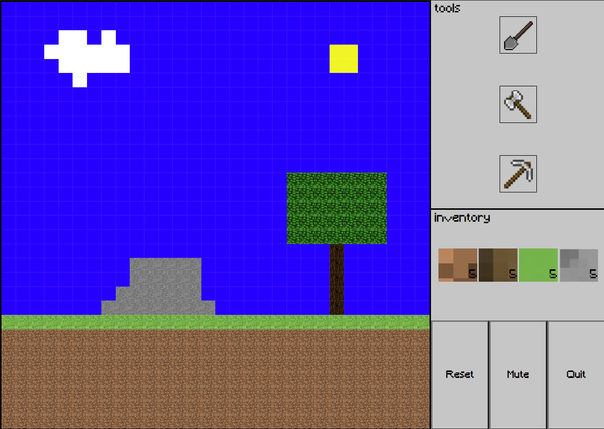

min3cr4f7

---

a 2d look A like minecraft , build as a weekend project in Fullstack course.

how to play:
- https://min3cr4f7.netlify.app/
- press start
- start crafting with the specific tool , and build your own place.

things i learned in this project :
- creating HTML thro JS vanilla.
- manipulate the DOM.
- media's responsive.
- use pseudo code.
- creating 2X2 matrix using two for loops

TODO : add more material's 
